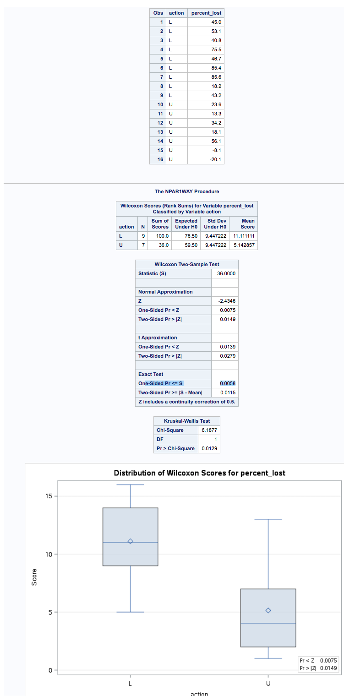
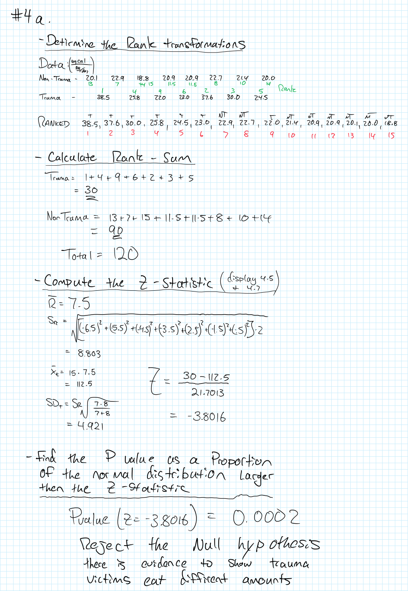
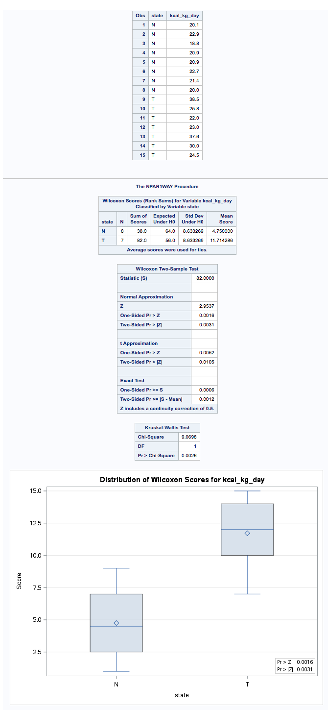
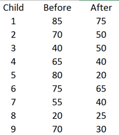
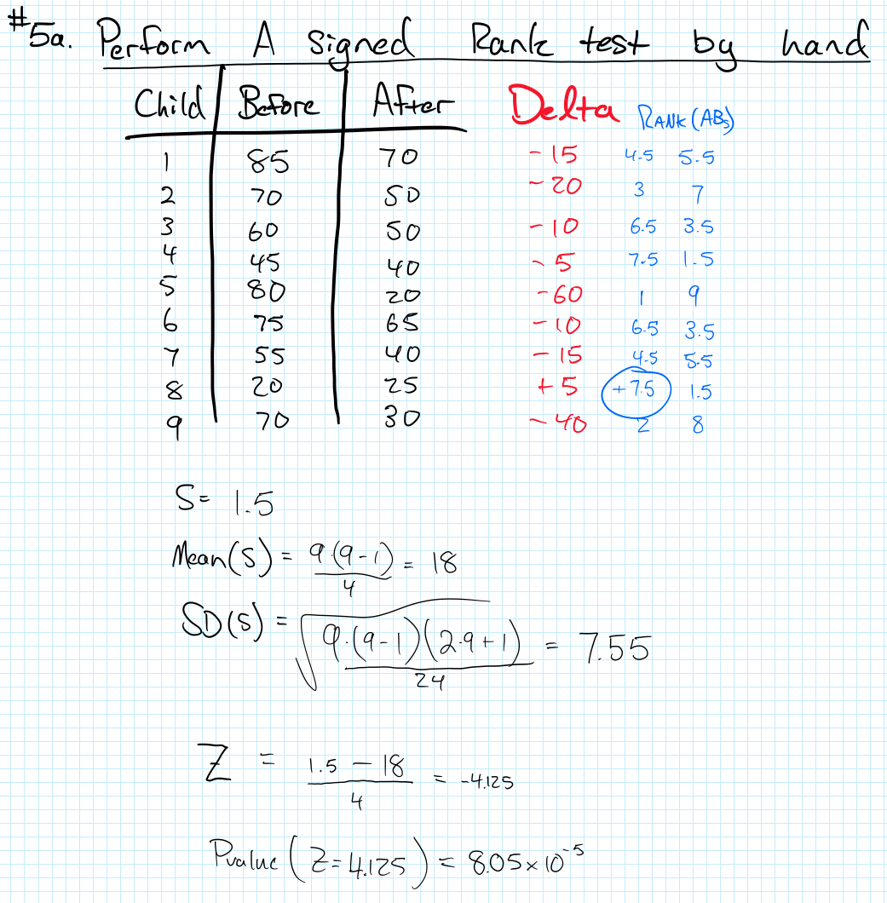
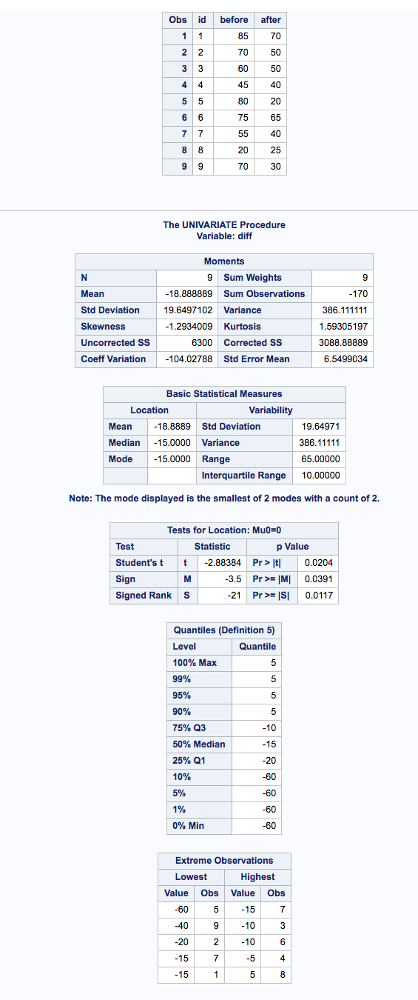

---
output:
  pdf_document: default
  html_document: default
---
--
title: "Doing Data Science - Assignment2 "
author: "Travis Deason"
date: "Sept, 14th 2017"
output:  pdf_document
---

# MSDS 6371 HW 4

```{r, echo=FALSE, message=FALSE}
rm( list = ls()); cat("\014")  # Clear environment
```


***
#### Question 1. Read Chapter 4 from Statistical Sleuth and answer the conceptual problems at the end of the chapter.  Note: You do not need to type these up and turn them in.  The answers are at the very end of the chapter


***
#### Question 2. When wildfires ravage forests, the timber industry argues that logging the burned trees enhances forest recovery; the EPA argues the opposite. The 2002 Biscuit Fire in southwest Oregon provided a test case.  Researchers selected 16 fire-affected plots in 2004, before any logging was done, and counted tree seedlings along a randomly located transect pattern in each plot.  They returned in 2005, after nine of the plots had been logged, and counted the tree seedlings along the same transects.  The percent of seedlings lost from 2004 to 2005 is recorded in the table below for logged (L) and unlogged (U) plots:

*a*\. Perform a complete analysis using a rank sum test in SAS. The data is on the LMS in the Data Sets folder: (Logging.csv).



*b*\. Verify the p-value and confidence interval by running the rank sum test in R (using R function Wilcox.test).  (You do not need to repeat the complete analysis … simply cut and paste a screen shot of your code and the output.) You may use: https://www.r-bloggers.com/wilcoxon-mann-whitney-rank-sum-test-or-test-u/ for reference. 

```{r, echo=TRUE, message=FALSE}
logging = read.csv('data/logging.csv')
names(logging) = c('action', 'percent_lost')
logged = subset(logging, action == 'L')$percent_lost
unlogged = subset(logging, action == 'U')$percent_lost
hist(logged)
hist(unlogged)
boxplot(logging$percent_lost~action, data=logging, xlab='Logging Action', ylab='Percent Lost')
wilcox.test(logged, unlogged, correct=FALSE, exact = TRUE, conf.level= .95)
```

* Statistical analysis was performed on the 16 sample logging dataset using the Wilcoxan rank sum.  The null hypothesis is that there is no diffirence in foliage lost in a forest fire due to logging efforts.  The rank sum method was used becuase the data is non-normal, the two datasets have uneven variance, and the Unlogged dataset has large outliers.  There are also not enough data-points to assume normaility due to the law of large numbers.  A two sided Wilcoxan rank sum test showed that the there is greater forest loss when the forest has been logged with a p value of .01154.  The confidence interval for this test is not shown because it was done using a rank-sum test.


***
#### Question 3.	Conduct a Welch’s two sample t-test on the Education Data from HW 3 (untransformed).  Perform a complete analysis:

*a*\.	State the problem, address the assumption, be sure and back your answer up with what you know about theory (CLT) as well as with histograms, box plots, q-q plots, etc.

```{r, echo=TRUE, message=FALSE}
education = read.csv('data/EducationData.csv')
edu_sub = education$Educ == 12
edu12 =  subset(education, Educ == 12)
edu16 = subset(education, Educ == 16)
print ('edu16')
summary(edu16)
print ('edu12')
summary(edu12)
qqnorm(edu16$Income2005, main= '16 years')
qqnorm(edu12$Income2005, main= '12 years')
hist(edu16$Income2005, main= '16 years')
hist(edu12$Income2005, main= '12 years')
boxplot(Income2005~Educ, data = education)
```

* Based on a study of the incomes of 1426 adults between the ages of 41 and 49 years old with educations between 12 and 16 years.  The dataset is non-normal, the data has diffirent varianes, and data is large.  We will test the null hypothesis that there is no diffirence between years of education and income levels later in life.
 
*b*\.	Show all 6 steps, including a thoughtful, thorough, yet non-technical conclusion. Include a confidence interval.

* The study is attmpting to address if there is a relationship between years of education and income levels later in life.  The null hypothesis is that there is no diffirence in income levels for those with 12 year and 16 year educations.
* The data used in this sample has many extremes.  While they may accuratly be considered part of the data, they introduce some confusion into the problem.  Both datasets have a large variance, and the set with the larger mean (the 16 year education level) also has the larger variance.  That makes this problem a good cantidate for a logarithmic transformation.
* Based on the fact that the higher income levels both have a higher mean and more values significently above the mean in the dataset, it seems likley that we will reject the null hypothesis; however, there is little diffirence in the median values of the two samples; so it is possible there is not enough evidence to reject the null hypothesis at a 95% confidence interval.

*c*\.	Include a scope of inference at the end. (You may copy and paste this from a previous HW if you’d like.)  

*d*\.	Verify the Welch’s t statistic and p-value with R (using R function t.test).  Simply cut and paste your R code and output.  You may use: http://rcompanion.org/rcompanion/d_02.html for reference. Would you prefer to run the log transformed analysis you ran in HW3 or do you feel this analysis is more appropriate?  Why or why not? (Make mention of the assumptions as well as the parameters that each test provides inference on. As you know, they are different

```{r, echo=TRUE, message=FALSE}
edu12_sample = sample(edu12$Income2005, 406)

t.test(edu16$Income2005,
       edu12_sample,
       var.equal=TRUE,
       alternative = 'two.sided')
```

*  Using a two sample welches t-test with 560 degrees of freedom (a sample of 406 participants were taken from the 12 year education group to allow for equivilant sample sizes.), we reject the null hypothesis with a p value of near zero and a confidence interval of 26497.58 to 40222.09.  The mean value for the 16 year education group was 69996.97, and the mean value for the 12 year education group was 36167.67.  This test assumes independence between the two expiremential groups and among the participants within the expiremential groups.

***
#### Question 4.  

*a*\. Problem 20 from the text.  Show all work.  “By hand” here means actually by hand.  Simply take a picture of your work and include it in your pdf/doc file.  Include your sorted, labeled, and ranked data; your calculation of the mean and standard.



*b*\. Problem 21 from the text.  Take a screen capture of the SAS output in addition to your response.



* The p-value generated from a one sided permutation test in SAS was slightly larger then the value generated from approximating normality in the rank sum value (.0006 verses .0002).  This is expected because the sample was not large enough to infer normality.  Had the sample been larger, these values would likley be similar as well.  It is important to note that both tests will reject the null hypothesis. 


*c*\. a.	Write up a complete analysis using the information you have gained from A and B.

**i**\.	State the problem.

* The metobloic expenditure rates were measured from two groups admitted to the hospital.  The control group is the group is presumed to be randomly sampled from paitents admitted for non-traumatic reasons.  The treatment group is a group of seven paitents admitted for due to multipule fractures (these paitents were admitted to the trauma ward.)  The null hypothesis is that there is no diffirence in metobolic expenditure rates between the two groups.

**ii**\. State the assumptions you are making and why you are making them.  Justify your decisions.  Print out any histograms, q-q plots, box plots, etc. that you use in your justification.

```{r, echo=TRUE, message=FALSE}
non_trauma = c(20.1, 22.9, 18.8, 20.9, 20.9, 22.7, 21.4, 20.0)
trauma = c(38.5, 25.8, 25.8, 22.0, 23.0, 37.6, 30.0, 24.5)

print('trauma')
summary(trauma)
sd(trauma)
print('non_trauma')
summary(non_trauma)
sd(non_trauma)

hist(trauma)
hist(non_trauma)

qqnorm(trauma)
qqnorm(non_trauma)
```

* The assumptions for this expirement is that the samples are indepenent, and randomly selected among their respective groups.  The trauma group is not normally distributed, and the variences are very diffirent between the two samples, and the sample size is not large enough to assume the central limit theorm.  We are using a rank sum because a t-test will not work. in this case.

**iii**\. Show all 6 steps of the hypothesis test for the rank sum test of the Trauma data.  Use the critical values, test statistics, p-values, etc. obtained above.  

**iv.**\.	Also include a scope of inference statement.

* In this test, we reject the null hypothesis based on a two sample wilcoxon permutation test, and an approximation of the normal distribution using the Wilcoxon rank sum with a p value of .0006 and .0002 respectivly.  The confidence interval for the rank sum test is 13.70 - 46.29 kcal/(kg/day).  Since this expirement was observational these findings cannot be used to determine causation but and they can only be applied to hospital populations.  Additionally, since the population was not radomly assigned tro groups, there could be confounding variables in play.

***
#### Problem 5. A study was performed to test a new treatment for autism in children.  In order to test the new method, parents of children with autism were asked to volunteer for the study in which 9 parents volunteered their children for the study.  The children were each asked to complete a 20 piece puzzle.  The time it took to complete the task was recorded in seconds.  The children then received a treatment (20 minutes of Yoga) and were asked to complete a similar but different puzzle.  The data from the study is below:



*a*\. Perform a signed rank test by hand showing the final table with the absolute differences, the signs and the ranks.  Also, show your calculation of the z-statistic for each case.  



*b*\. Verify your calculation in both SAS and R.  Simply cut and paste your code and relevant output.  

```{r, echo=TRUE, message=FALSE}
children <- data.frame(c(1,2,3,4,5,6,7,8,9),
                         c(85,70,60,45,80,75,55,20,70),
                         c(70,50,50,40,20,65,40,25,30))
names(children) <- c('id', 'before', 'after')
children$diff = children$after - children$before
wilcox.test(children$before, children$after,
             paired= TRUE,
             conf.level= .95)
```



*c*\. Conduct the six step hypothesis test using your calculations from above to test the claim that the yoga treatment was effective in reducing the time to finish the puzzle.   

* On the yoga puzzle complietion study, the null hypothesis is that Yoga has no effect on the time taken for children to complete a puzzle.  The Test was done in pairs; so each student was given a puzzle prior to performing 20 min of yoga then were asked to complete a similar puzzle after the 20 min of yoga.  The assumptions are that the test were similar enough to require similar apptitudte, but not so similar that completing one puzzle would make the subsequent puzzle easier.  Since the test are paired, we cannot assume independence, and since the children were voulenteered for the study, we cannot asume this is a representative sample of the population of children.

*d*\. Use SAS to conduct the six step hypothesis test using your paired t-test analysis to test the claim that the yoga treatment was effective in reducing the time to finish the puzzle. 

*f*\.  Use your data from above to construct a “complete analysis” of the test that you feel is most appropriate to test the claim that the yoga treatment was effective in reducing the time to finish the puzzle.  This is simply formatting your results.  You should be able to cut and paste most of the work from above.   

* By performing a paired wilcoxon rank sum test with a sample size of 9 students and a significence level of .95, we reject the null hypothesis in all of the testing methods (1. Applying the rank sum test to estimate normality, running a paired rank-sum wilcoxon test in R, and running a paired rank-sum permutation test in R.) with a p-value of 8.05**10-5, .01489, and .0346, and a confidence interval of 10.16 - 25.84.  Among children who are voulenteered for a study by thier parents, there is evidence to suggest the child will improve thier performance on a puzzle test when administered directly after yoga, (presuming a similar puzzle was administered prior to yoga as well).  Because the sample is not independent, further inferance cannot be made.


