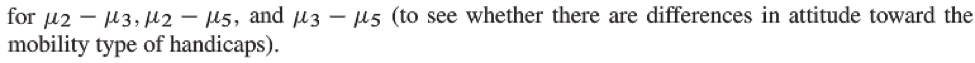
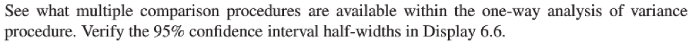
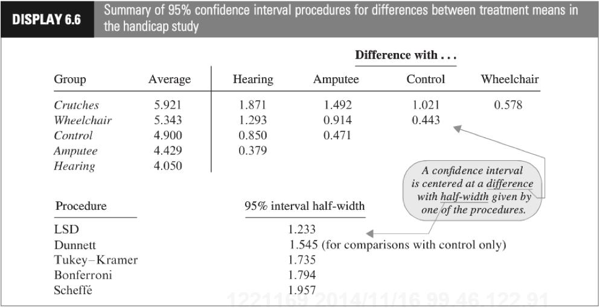
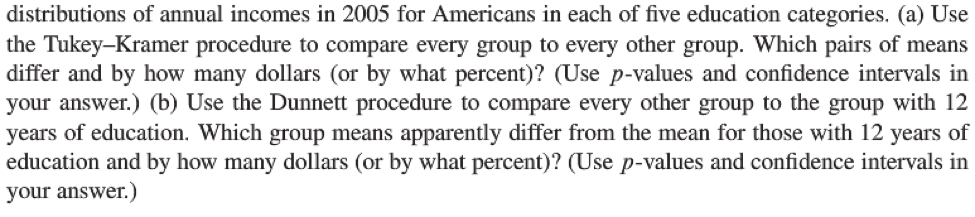

---
output:
  word_document: default
  pdf_document: default
  html_document: default
---
--
title: "Statistical Foundations for Data Science - Assignment6 "
author: "Travis Deason"
date: "Oct 8th 2017"
output:  word_document
---

# MSDS 6371 HW 6

```{r, echo=FALSE, message=FALSE}
rm( list = ls()); cat("\014")  # Clear environment
#install.packages('mvtnorm')
#install.packages('survival')
#install.packages('splines')
#install.packages('multcomp')
#install.packages('DescTools')
#install.packages('agricolae')
library(mvtnorm)
library(survival)
library(splines)
library(multcomp)
library(DescTools)
library(agricolae)
```
*** 

## 1.	µ1, µ2, µ3, µ4, and µ5, are the mean scores in the none, amputee, crutches, hearings and wheelchair groups respectively.  Be careful when identifying ‘k’ here.


```{r, echo=TRUE, message=FALSE}
hcap <- read.csv('data/case0601handicap_2.csv')
names(hcap) = sapply(names(hcap), tolower)
summary(subset(hcap, handicap == 'Amputee')$score)
summary(subset(hcap, handicap == 'Crutches')$score)
summary(subset(hcap, handicap == 'Wheelchair')$score)
amp.crutches <- subset(hcap, handicap == 'Amputee' | handicap == 'Crutches')
print('Amputee vs Crutches')
t.test(score~handicap, data=amp.crutches)
amp.wheelchair <- subset(hcap, handicap == 'Amputee' | handicap == 'Wheelchair')
print('Amputee vs Wheelchair')
t.test(score~handicap, data= amp.wheelchair)
crutches.wheelchair <- subset(hcap, handicap == 'Crutches' | handicap == 'Wheelchair')
print('Wheelchair vs Crutches')
t.test(score~handicap, data= crutches.wheelchair)
```

# Based on three seperate two sample t-tests with a significence level of .05, We fail to reject the null hypothesis that there is no diffirence in the observed test score for an applicant in crutches verses an applicant in a wheelchair, or an amputee verses an applicant in a wheelchair.  These tests were rejected with a p value of .3538 and .1593 respectivly.  There was, however an observed diffirence between the cantidate who used crutches, and the amputee.  In this case, we reject the null hypothesis with a p value of .0164.

***

## 2.	To show your work for this problem by simply copying the code and relevant output for each comparison.  (Cut and paste your code.)  Do this for both R and SAS.


 
```{r, echo=TRUE, message=FALSE}
#boxplot(score~handicap, data=hcap)
#hist(subset(hcap, handicap='Amputee')$score)
#hist(subset(hcap, handicap='Crutches')$score)
#hist(subset(hcap, handicap='Hearing')$score)
#hist(subset(hcap, handicap='None')$score)
#hist(subset(hcap, handicap='Wheelchair')$score)
#model = lm(score ~ handicap, data=hcap)
#(LSD.test(model, "handicap", alpha = 0.05, p.adj="none"))
#(HSD.test(model, "Location")) 
#mc = glht(model, mcp(handicap = "Tukey"))
#summary(mc, test=adjusted("single-step"))
#DunnettTest(score ~ handicap, data = hcap, control='None')
```
* Since the data is normally distributed, has equal vairance, and indepdendence can be assumed because the cantidates were chosen at random.  Any of the tests would be valid.  Since it would make sense to compare each set to the group without a dissability.  We will use the Tukey Kramer, LSD, Bonferroni, and Dunnett's method for comparing multipule means.  In our testing...

>* Dunnett's test shows not enough evidence to reject the null hypothesis that any of the handicapped groups differ from the control group.  The lowest p-value here is the crutches group with a p-value of .2918.

>* LSD shows we can reject the null hypothesis, that all groups have the same mean, for crutches verses amputee and hearing, amputee verses crutches, and hearing verses wheelchair.  We once agian reject the null hypothesis will all groups when compared to no dissability.

> Tukey Kramer gives us P values of .1 or higher for all compared groups with the exception of Hearing verses Crutches.  In this case, we only reject the null hypothesis with hearing verses crutches.  All other groups do not have significent evidence to reject the null hypothesis.
 
***
## 3.	This question is obviously from the book, but assume you are starting this problem from scratch.  Show all parts:  (1) Discussion of Assumptions (2) Selection and Execution of Tests (3) Interpretation and Conclusion.   In short, perform a complete analysis like you usually do.   Provide and interpret all the confidence intervals that suggest a significant difference in mean incomes; provide your SAS and R code as well.  (Generate your statistics using both softwares.) 



```{r, echo=TRUE, message=FALSE}
inc.data <- read.csv('data/ex0330.csv')
names(inc.data) <- sapply(names(inc.data), tolower)
boxplot(income2005 ~ educ, data= inc.data)
model = lm(income2005 ~ educ, data=inc.data)
#mc = glht(model, mcp(educ = "Tukey"))
#summary(mc)
t.test(income2005 ~ educ, data=inc.data)
```

*  The only education groups included in the csv are 12 and 16 years.  Because of this,  we cannot use Tukey Kramer's test.  We must use a standard t-test.  In this case, since data is very large in both groups, we can assume the CLT will kick in, and as long as the data is indepdndent, we can use a standard t-test.  Using th t-test with 473.8 degrees of freedom, we reject the null hypothesis that income is equal between the two groups with a p-value of virtuually zero.
