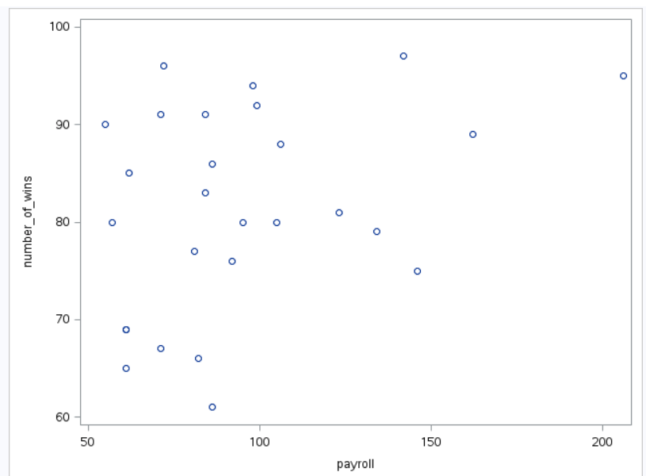
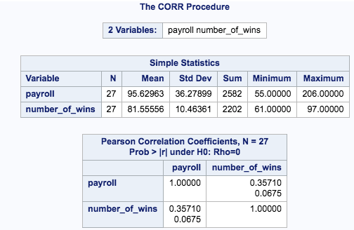

---
output:
  word_document: default
---
--
title: "Statistical Foundations for Data Science - Assignment8 "
author: "Travis Deason"
date: "Oct 22nd 2017"
output:  word_document
---

# MSDS 6371 HW 8

```{r, echo=FALSE, message=FALSE}
rm( list = ls()); cat("\014")  # Clear environment
#install.packages('Hmisc')
#install.packages('ggplot2')
library(Hmisc)
library(ggplot2)

baseball <- read.csv('data/Baseball_Data.csv')
names(baseball) <- sapply(names(baseball), tolower)
```
*** 

#### Americans love their baseball.  Even so, there is a concern that teams with more money to spend on players have more success than teams that have less money to spend.  The payroll (X) (in millions of dollars) and the number of games won in the season (out of 162) (Y) are provided in the table below for the 30 major league teams.  The numbers are from the 2010 regular season.  We can use these data to illustrate statistical methods for drawing inferences about correlations.  
 
## 1.	Provide a scatterplot of the data using both SAS and R. Looking at the scatterplot, do you expect the correlation to be positive, negative, or close to 0?  Why?  Is the relationship between team payroll and number of wins strong, moderate or weak?  Is the relationship linear?  Take a guess of the value of the correlation coefficient.  

```{r, echo=TRUE, message=FALSE}
plot(baseball$payroll, baseball$wins, main='Payroll vs Number of wins', xlab= 'Payroll (in millions)', ylab= 'Number of wins')
```


>* The correlation between payroll and number of wins is strong, but it is not a perfect 1:1 relationship.  Higher payroll appears to mean more wins.

***
## 2.	Find the correlation between team payroll and the number of wins (no fair going back and changing your answer to the previous question)!  You should do this in both R and SAS. 
```{r, echo=FALSE, message=FALSE}
cor(baseball$payroll, baseball$wins)
```


 > there is a .366 correlation between team payroll and number of wins

***
## 3.	San Diego (SD) has a payroll of 38 million, yet has 90 wins – more than Boston does.  Delete SD from the data and rerun the analysis.  How does the correlation change?  You may use your preference here, R or SAS.  
```{r, echo=TRUE, message=FALSE}
nbb_noSD <- subset(baseball, team != 'SD')
cor(nbb_noSD$payroll, nbb_noSD$wins)
```

>* the correlation coefficent changes from .36 to .425 when you remove San Diego from the dataset.  This is still a fairly weak coefficent.

***
## 4.	The league commissioner notes that the Texas Rangers with one of the lowest payrolls won 90 games (and were the American League Champions) and the Chicago Cubs with the highest payroll won only 75 games.  This, he argues, proves there is no advantage to teams with a higher payroll.  Comment on his argument.  

```{r, echo=TRUE, message=FALSE}
model <- lm(wins~payroll, data=baseball)
summary(model)
```

>* There is some evidence to support that there is an atvantage to having a higher payroll.  However, there while there may be evidence to support a correlation between payroll and the correlation is not enough to be considered statistically significent.  Therefore, we cannot reject the commissioner's allegation that there is no corealation between team performance and payroll.

***
## 5.	What is the population for these data? Can these data be considered a random sample from that population?  

>* The population for these data is all baseball teams.  It cannot be considered a random sample because the sample is inclusive of the population.  However, since the entire population is included, there is no need to generate a random sample.

