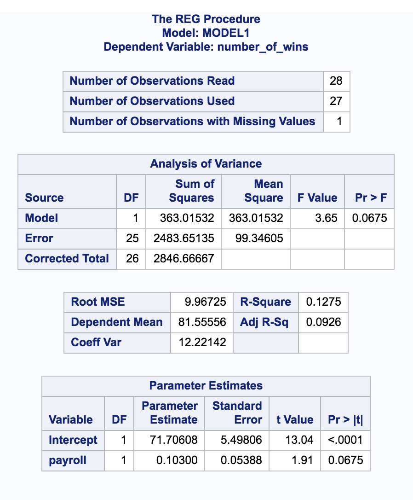

---
output:
  word_document: default
---
--
title: "Statistical Foundations for Data Science - Assignment8 "
author: "Travis Deason"
date: "Oct 22nd 2017"
output:  word_document
---

# MSDS 6371 UNIT 9 HW
* These are the same data from last week’s HW.  Now, we are going to use them for simple linear regression.

```{r, echo=FALSE, message=FALSE}
rm( list = ls()); cat("\014")  # Clear environment
library(Hmisc)
library(ggplot2)
baseball <- read.csv('data/Baseball_Data.csv')
names(baseball) <- sapply(names(baseball), tolower)
```
 
### 1a.Find the least squares regression line using payroll to predict the number of wins. Interpret the slope and the intercept in the context of the problem. Show your work in finding the slope and intercept … you will need the above calculations.

```{r, echo=TRUE, message=FALSE}
#model <- lm(payroll~wins, data=baseball)
#summary(model)
#beta1 = sum(((baseball$payroll) - mean(baseball$payroll) * (baseball$wins) - mean(baseball$wins))) /  sum(baseball$payroll - mean(baseball$payroll) ** 2)
beta1 = 4461 / 42247.37
beta0 = mean(baseball$wins) - beta1 * mean(baseball$payroll)
```

>* The slope of the number of wins verses payroll (0.907) is how many additional wins each season a team will get for each additional million dollars they spend on team payroll.

>* The y intercept (-12.652) is the number of wins a team can expect if they spend no money on payroll.


### b. Is the slope (just the slope) of the regression line significantly different than zero? Carry out a 6 step hypothesis test to address this question.  Use the above calculations to find the relevant statistics for this test.  You will need to use SAS or the internet or a calculator or integration to find the p-value. (I suggest 1 of the first 3. )

```{r, echo=TRUE, message=FALSE}
#qt(.975, 28, 1)
#pt(3.14889, 28, 1)
pred = (baseball$payroll* beta1) + beta0
sse = sum(((pred - baseball$wins)**2))
mse = sqrt(sse / 28)
se = mse / sqrt(sum((baseball$payroll - mean(baseball$payroll) **2)))
mean(baseball$payroll)
mean(baseball$wins)
fcrit = qt(.975, 28)
```

>* In testing to see if there is a statistically significent correlation between the amount a team spends on payroll and the number of wins that team will recieve, the null hypothesis is that the Slope is equal to zero, and our alternative hypothesis is that the absolute value of the slope is greater then zero.

>* The assumptions are that the relationship between payroll and number of wins ins linear.  By looking at a plot of the residuals, the residuals appear randomly distributed.  The residuals appear to be normally distirbuted evenly throughout the x axis; so I will assume linearity, normality of the residuals, and equivilant distribution

>* For a significence level of .05, our critical F-value is 4.196

>*  The test statistic for this F-test is 4.337, and the p-value is .04654.  Since the P value is less then .05, we reject the null hypothesis that there is no coorelation between a team's payroll and how many games they will win in a season.  There is evidence that shows that teams that spend more money on payroll tend to win more games.  We cannot infeer this relationship to be causal because payroll was not randomly assigned to the team.  We also cannot infer these results to any sport outside the MLB.

### c. Calculate a 95% confidence interval for the slope and interpret the interval.

```{r, echo=TRUE, message=FALSE}
ci_max = beta1 + fcrit*.0507
ci_min = beta1 - fcrit*.0507
ci = c(ci_min, ci_max)
print(ci)
```

>* The confidence interval for the relationship between a team's payroll  and the number of wins in a season at a 95% confidence interval is from .00173 to 0.2094.  Since this range does not include 0, we will reject the null hypothesis


### d. Verify your results with both SAS and R.  Paste your code below. 



```{r echo=TRUE, message=FALSE}
model <- lm(payroll~wins, data=baseball)
summary(model)
confint(model)
```


#### 2a. Find the least squares regression line to assess the relationship between the math and the science score.  We would like to be able to estimate a change in the mean math score for a one point change in the mean science score.  (This should help identify the response and the independent variables.) Interpret the slope and the intercept in the context of the math and science scores.   You should obtain the test statistics and other relevant statistics from SAS or R.  Write your regression equation and Paste your code below (SAS OR R).  

```{r echo=TRUE, message=FALSE}
scores <- read.csv('data/week9.csv')
sch_model <- lm(math~science, data=scores)
plot(scores$science, scores$math)
summary(sch_model)
```

>* Based on a linear regression between the science and math scores.  There is a strong evidence to suggest that high scores in science are good predicitors of high scores in math.  The regression showed a slope of .59, meaning a for every 1 point incrrease in science scores, there should be a corresponding .59 point increase in math scores.  The intercept for this equation is 21, meaning someone who scored 0 on a science test should exepct to see a math score of 21.7.  This model is able to explain 39% of the variation in the data, but the p-value is negligable, and the f-statistic is 130.8 on 198 degrees of freedom.  This existance of this coorelation is near certian.


#### 2b. Is the slope and intercept of the regression line significantly different than zero? Carry out a 6 step hypothesis test for each regression parameter to address this question.  You should obtain the test statistics and other relevant statistics from SAS or R.  Paste your code below.  Formalize the analysis in a 6 step format.

```{r echo=TRUE, message=FALSE}
plot(scores$science, sch_model$residuals)
sse = sum(sch_model$residuals ** 2)
se = (sqrt(sse) / (1998)) / sqrt(sum((scores$science - mean(scores$science))**2))
T_value = 0.596814 / se
print(T_value)
sch_model$coefficients['science']
```

>* The null hypothesis is that the the slope is non-zero (math scores anc science scores are independent), the alternative hypothesis is that there is a coorelation between math scores and science scores.

>* It is assumed that the data is independent, the residuals are normally distributed and of equal varaince, and the relationship between the math and science scores is linear.  All of these assumptions appear to be met in the dataset.

>* The critical T-value for our test with 1998 degrees of freedom is .8351.  The test statistic is 1623, so we reject the null hypothesis with a .95% confidence interval

>* Based on a two sided hypothesis test, we can confirm that there is a positive coorelation between math and science test scores.  Since this is an observational study, we cannot assume this relationship is causal.

#### 2c. Calculate 99% confidence intervals for the slope and intercept and interpret these intervals (by hand).

```{r echo=TRUE, message=FALSE}
cv <- pt(.995, 1998)
ci <- c(sch_model$coefficients['science'] + cv* se,
       sch_model$coefficients['science'] - cv* se)
print(ci)
```

>* The 99% confidence interval for the coefficent score between math and science students is 0.5971228 to 0.5965053

#### 2d. Verify your confidence interval with SAS or R and paste your code below.  

```{r echo=TRUE, message=FALSE}
confint(sch_model, level=.99 )
```


